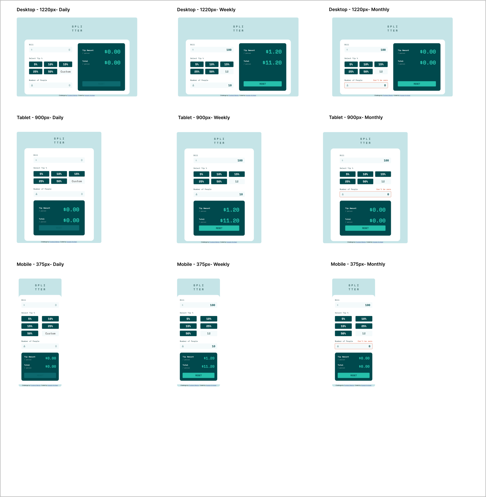

# Frontend Mentor - Tip calculator app solution

This is a solution to the [Tip calculator app challenge on Frontend Mentor](https://www.frontendmentor.io/challenges/tip-calculator-app-ugJNGbJUX). Frontend Mentor challenges help you improve your coding skills by building realistic projects.

## Table of contents

- [Overview](#overview)
  - [The challenge](#the-challenge)
  - [Screenshot](#screenshot)
  - [Links](#links)
- [My process](#my-process)
  - [Built with](#built-with)
  - [What I learned](#what-i-learned)
  - [Useful resources](#useful-resources)
- [Author](#author)

## Overview

### The challenge

Users should be able to:

- View the optimal layout for the app depending on their device's screen size
- See hover states for all interactive elements on the page
- Calculate the correct tip and total cost of the bill per person

### Screenshot

### Links

- Solution URL: [Solution URL](https://github.com/hussaindev94/frontend-mentor-challenges-tip-calculator-app)
- Live Site URL: [Live site URL](https://hussaindev94.github.io/frontend-mentor-challenges-tip-calculator-app/)

## My process

### Built with

- Semantic HTML5 markup
- CSS custom properties
- Flexbox
- Mobile-first workflow

### What I learned
- I learned using pure functions in my code base.
- I learned how to manage state for different elements in the project.
- Make function do one thing only in the code.

### Useful resources

- [Resource 1](https://medium.com/@london.lingo.01/the-art-of-code-refactoring-in-javascript-techniques-for-improving-code-quality-edbfd119584a) - This resource give me different techniques for improving code quality.
- [Resource 2](https://www.digitalocean.com/community/posts/5-tips-to-write-better-conditionals-in-javascript) - This resource give me tips and trick of how to write better conditionals in JS.
- [Resource 3](https://medium.com/@akhilanand.ak01/the-power-of-pure-functions-in-javascript-writing-reliable-and-maintainable-code-fc8a376996f2) - This resource introduce me t opure functions to write reliable and maintainable code.

## Author

- Website - [Hussain Al-shaer](https://hussaindev94.github.io/Portfolio/)
- Frontend Mentor - [@hussaindev94](https://www.frontendmentor.io/profile/hussaindev94)
- X - [@hussaindev94](https://x.com/hussaindev94)
